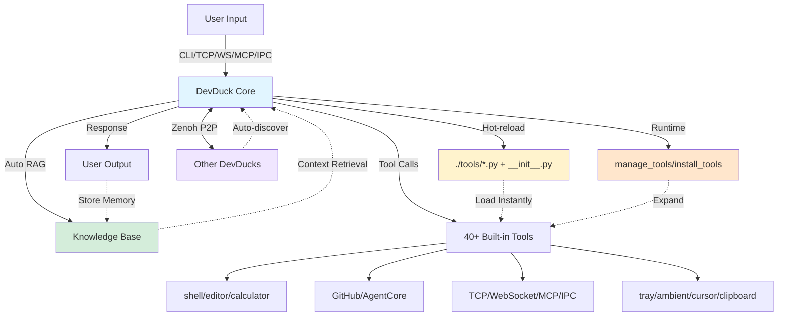

# 🦆 DevDuck

[](https://pypi.org/project/devduck/)

**Self-modifying AI agent that hot-reloads its own code—builds itself as it runs.**

One Python file that adapts to your environment, fixes itself, and expands capabilities at runtime.

Learn more: https://duck.nyc

## 🎬 See It In Action

| Feature | What You'll See | Demo |
|---------|----------------|-------|
| 🔥 **Hot-Reload** | Agent detects code changes and restarts instantly | [Watch](https://redduck.dev/videos/hot-reload.mp4) |
| 🌐 **Web UI** | Clean web interface with real-time streaming | [Watch](https://redduck.dev/videos/web-ui.mp4) |
| 🛠️ **Dynamic Tools** | Save `.py` file in `./tools/` → use instantly | [Watch](https://redduck.dev/videos/dynamic-tool-creation.mp4) |
| 🌊 **TCP Streaming** | Connect via netcat, apps, or other agents | [Watch](https://redduck.dev/videos/tcp.mp4) |
| 🔗 **Zenoh P2P** | Auto-discover & coordinate multiple DevDucks | Multi-terminal magic ✨ |
| 🎬 **Session Recording** | Record, replay & resume agent sessions | Time-travel debugging 🕰️ |
| 🌙 **Ambient Mode** | Background thinking while you're idle | Auto-explores topics 🧠 |
| 🔌 **IPC & Tray** | macOS menu bar + Unix socket IPC |  |
| 💬 **Ambient Overlay** | Floating AI input with glassmorphism UI | [Watch](https://redduck.dev/videos/floating-input.mp4) |

---

## Quick Start

```bash
# Install & run
pipx install devduck && devduck

# With speech-to-speech capabilities (optional)
pipx install "devduck[speech]" && devduck

# One-shot query
devduck "create a REST API with FastAPI"

# Python API
python -c "import devduck; devduck('analyze this code')"

# Session recording (time-travel debugging)
devduck --record "analyze this codebase"
# → Exports to /tmp/devduck/recordings/session-*.zip

# Resume from recorded session
devduck --resume session-20250202-123456.zip "continue where we left off"
```

**Requirements:** Python 3.10-3.13, AWS credentials (or Ollama/Anthropic/GitHub/MLX)

**Optional extras:**
- `devduck[speech]` - Real-time speech-to-speech conversations (Nova Sonic, OpenAI Realtime, Gemini Live)

---

## Core Capabilities

| Feature | What It Does | How to Use |
|---------|--------------|------------|
| 🔥 **Hot-Reload** | Auto-restarts on code changes | Edit `__init__.py` → saves → auto-restart |
| 🛠️ **Runtime Tools** | Add/remove tools without restart | `manage_tools(action="add", ...)` |
| 📦 **Dynamic Loading** | Install packages and load tools on-the-fly | `install_tools(action="install_and_load", package="...")` |
| 🧠 **Auto-RAG** | Remembers conversations via Knowledge Base | Set `DEVDUCK_KNOWLEDGE_BASE_ID` |
| 🌊 **Multi-Protocol** | TCP, WebSocket, MCP, IPC servers | Auto-starts on ports 9999, 8080, 8000 |
| 🔗 **Zenoh P2P** | Auto-discover & coordinate with other DevDucks | `zenoh_peer(action="broadcast", message="...")` |
| 🔌 **MCP Client** | Connect to external MCP servers | Set `MCP_SERVERS` env var |
| 🎬 **Session Recording** | Record & replay entire sessions | `devduck --record` or `session_recorder()` |
| 💾 **State Time-Travel** | Save/restore agent state | `state_manager(action="export")` |
| 🌙 **Ambient Mode** | Background thinking when idle | `DEVDUCK_AMBIENT_MODE=true` or type `ambient` |
| 📝 **Self-Improvement** | Updates own system prompt | `system_prompt(action="add_context", ...)` |
| ☁️ **AWS Deploy** | One-command serverless | `agentcore_config(auto_launch=True)` |
| 🎤 **Speech-to-Speech** | Real-time voice conversations | `pip install devduck[speech]` |

---

## Developer Setup

```bash
git clone git@github.com:cagataycali/devduck.git
cd devduck
python3.13 -m venv .venv
source .venv/bin/activate

# Basic install
.venv/bin/pip3.13 install -e .

# With speech capabilities
.venv/bin/pip3.13 install -e ".[speech]"

devduck
```

---

## Architecture



**Self-adapting loop:** Query → RAG → Tools → Response → Memory → Hot-reload/Runtime-load → Repeat

---

## Model Setup

DevDuck **auto-detects** providers based on credentials:

**Priority:** Bedrock → Anthropic → OpenAI → GitHub → Gemini → Cohere → Writer → Mistral → LiteLLM → LlamaAPI → MLX → Ollama

| Provider | API Key | Auto-Detected |
|----------|---------|---------------|
| **Bedrock** | AWS credentials | ✅ If `boto3` auth succeeds |
| **Anthropic** | `ANTHROPIC_API_KEY` | ✅ If key present |
| **OpenAI** | `OPENAI_API_KEY` | ✅ If key present |
| **GitHub** | `GITHUB_TOKEN` or `PAT_TOKEN` | ✅ If key present |
| **Gemini** | `GOOGLE_API_KEY` or `GEMINI_API_KEY` | ✅ If key present |
| **Cohere** | `COHERE_API_KEY` | ✅ If key present |
| **Writer** | `WRITER_API_KEY` | ✅ If key present |
| **Mistral** | `MISTRAL_API_KEY` | ✅ If key present |
| **LiteLLM** | `LITELLM_API_KEY` | ✅ If key present |
| **LlamaAPI** | `LLAMAAPI_API_KEY` | ✅ If key present |
| **MLX** | No key needed | ✅ On Apple Silicon (M1/M2/M3) |
| **Ollama** | No key needed | ✅ Fallback if nothing else found |

**Just set your API key - DevDuck handles the rest:**
```bash
export ANTHROPIC_API_KEY=sk-ant-...
devduck  # Auto-uses Anthropic

export OPENAI_API_KEY=sk-...
devduck  # Auto-uses OpenAI

export GOOGLE_API_KEY=...
devduck  # Auto-uses Gemini
```

**Manual override:**
```bash
export MODEL_PROVIDER=bedrock
export STRANDS_MODEL_ID=us.anthropic.claude-sonnet-4-20250514-v1:0
devduck
```

---

## Tool Management

### Runtime Tool Management

Add, remove, or reload tools while agent is running:

```python
# List all loaded tools
manage_tools(action="list")

# Add tools from a package at runtime
manage_tools(action="add", package="strands_fun_tools", tool_names="cursor,clipboard,bluetooth")

# Remove tools you don't need
manage_tools(action="remove", tool_names="cursor,clipboard")

# Reload specific tools after editing
manage_tools(action="reload", tool_names="shell,editor")

# Reload all tools (restarts agent)
manage_tools(action="reload")

# Load custom tool from file
manage_tools(action="add", tool_path="./my_custom_tool.py")
```

### Dynamic Package Installation

Install Python packages and load their tools at runtime:

```python
# Discover available tools before loading
install_tools(action="list_available", package="strands-fun-tools", module="strands_fun_tools")

# Install package and load all tools
install_tools(action="install_and_load", package="strands-agents-tools", module="strands_tools")

# Install and load specific tools only
install_tools(
    action="install_and_load",
    package="strands-fun-tools", 
    module="strands_fun_tools",
    tool_names=["clipboard", "cursor", "bluetooth"]
)

# Load tools from already installed package
install_tools(action="load", module="strands_tools", tool_names=["shell", "calculator"])

# List currently loaded tools
install_tools(action="list_loaded")
```

### Static Tool Configuration

**Format:** `package1:tool1,tool2;package2:tool3,tool4`

```bash
# Minimal (shell + editor only)
export DEVDUCK_TOOLS="strands_tools:shell,editor"

# Dev essentials
export DEVDUCK_TOOLS="strands_tools:shell,editor,file_read,file_write,calculator"

# Full stack + GitHub
export DEVDUCK_TOOLS="devduck.tools:tcp,websocket,mcp_server,use_github;strands_tools:shell,editor,file_read"

devduck
```

### Hot-Reload Tools from Directory

Create `./tools/weather.py`:
```python
from strands import tool
import requests

@tool
def weather(city: str) -> str:
    """Get weather for a city."""
    r = requests.get(f"https://wttr.in/{city}?format=%C+%t")
    return r.text
```

**Enable directory auto-loading:**
```bash
export DEVDUCK_LOAD_TOOLS_FROM_DIR=true
devduck
# Save weather.py → use instantly (no restart needed)
```

**Default:** Directory loading is OFF. Use `manage_tools()` or `install_tools()` for explicit control.

---

## Speech-to-Speech (Optional)

**Install speech capabilities:**
```bash
pip install "devduck[speech]"
```

**Real-time voice conversations** with multiple providers:

```python
# Start speech session with Nova Sonic (AWS Bedrock)
speech_to_speech(action="start", provider="novasonic")

# Start with OpenAI Realtime API
speech_to_speech(action="start", provider="openai")

# Start with Gemini Live
speech_to_speech(action="start", provider="gemini_live")

# Custom voice and settings
speech_to_speech(
    action="start",
    provider="novasonic",
    model_settings={
        "provider_config": {"audio": {"voice": "matthew"}},
        "client_config": {"region": "us-east-1"}
    }
)

# Stop session
speech_to_speech(action="stop", session_id="speech_20250126_140000")

# Check status
speech_to_speech(action="status")

# List conversation histories
speech_to_speech(action="list_history")

# List available audio devices
speech_to_speech(action="list_audio_devices")
```

**Supported Providers:**
- **Nova Sonic (AWS Bedrock):** 11 voices (English, French, Italian, German, Spanish)
- **OpenAI Realtime API:** GPT-4o Realtime models
- **Gemini Live:** Native audio streaming

**Environment Variables:**
- `OPENAI_API_KEY` - For OpenAI Realtime
- `GOOGLE_API_KEY` or `GEMINI_API_KEY` - For Gemini Live
- AWS credentials - For Nova Sonic (boto3 default credential chain)

**Features:**
- Background execution (parent agent stays responsive)
- Tool inheritance from parent agent
- Conversation history saved automatically
- Natural interruption with VAD
- Custom audio device selection

---

## MCP Integration

### As MCP Server (Expose DevDuck)

**Claude Desktop** (`~/Library/Application Support/Claude/claude_desktop_config.json`):
```json
{
  "mcpServers": {
    "devduck": {
      "command": "uvx",
      "args": ["devduck", "--mcp"]
    }
  }
}
```

**Or start HTTP MCP server:**
```python
mcp_server(action="start", port=8000, stateless=True)
# Connect at: http://localhost:8000/mcp
```

**Modes:** `--mcp` (stdio for Claude Desktop) | `http` (background server) | `stateless=True` (multi-node)

### As MCP Client (Load External Servers)

**Expand capabilities** by loading tools from external MCP servers:

```bash
export MCP_SERVERS='{
  "mcpServers": {
    "strands-docs": {"command": "uvx", "args": ["strands-agents-mcp-server"]},
    "remote": {"url": "https://api.example.com/mcp", "headers": {"Auth": "Bearer token"}},
    "custom": {"command": "python", "args": ["my_server.py"]}
  }
}'
devduck
```

**Supported transports:** stdio (`command`/`args`/`env`) | HTTP (`url`/`headers`) | SSE (`url` with `/sse` path)

**Tool prefixing:** Each server's tools get prefixed (e.g., `strands-docs_search_docs`)

---

## Zenoh Peer-to-Peer Networking

**Auto-discover and coordinate** multiple DevDuck instances across terminals or networks.

### How It Works

1. Each DevDuck joins a Zenoh peer network
2. Multicast scouting (224.0.0.224:7446) auto-discovers peers on local network
3. Peers exchange heartbeats to maintain presence awareness
4. Commands can be broadcast to ALL peers or sent to specific peers
5. Responses stream back in real-time

### Quick Start

```bash
# Terminal 1: Start DevDuck (Zenoh enabled by default)
devduck
# 🦆 ✓ Zenoh peer: hostname-abc123

# Terminal 2: Start another DevDuck
devduck
# 🦆 ✓ Zenoh peer: hostname-def456
# Auto-discovers Terminal 1!

# Terminal 1: See discovered peers
🦆 zenoh_peer(action="list_peers")

# Terminal 1: Broadcast to ALL DevDucks
🦆 zenoh_peer(action="broadcast", message="git status")
# Both terminals execute and stream responses!

# Send to specific peer
🦆 zenoh_peer(action="send", peer_id="hostname-def456", message="what files are here?")
```

### Cross-Network Connections

Connect DevDuck instances across different networks:

```bash
# Machine A (office): Listen for remote connections
export ZENOH_LISTEN="tcp/0.0.0.0:7447"
devduck

# Machine B (home): Connect to office
export ZENOH_CONNECT="tcp/office.example.com:7447"
devduck

# Now they can communicate!
🦆 zenoh_peer(action="broadcast", message="sync all repos")
```

### Use Cases

| Scenario | Command | Description |
|----------|---------|-------------|
| **Multi-terminal ops** | `broadcast "git pull && npm install"` | Run on all instances |
| **Distributed tasks** | `broadcast "analyze ./src"` | Parallel analysis |
| **Peer monitoring** | `list_peers` | See all active DevDucks |
| **Direct messaging** | `send peer_id="..." message="..."` | Task specific instance |
| **Cross-network** | Set `ZENOH_CONNECT` | Connect home ↔ office |

### Actions

```python
# Start Zenoh networking (auto-starts by default)
zenoh_peer(action="start")

# Stop Zenoh
zenoh_peer(action="stop")

# Check status and peer count
zenoh_peer(action="status")

# List all discovered peers
zenoh_peer(action="list_peers")

# Broadcast to ALL peers (waits for responses)
zenoh_peer(action="broadcast", message="your command", wait_time=60)

# Send to specific peer
zenoh_peer(action="send", peer_id="hostname-abc123", message="your command", wait_time=120)

# Start with remote connection
zenoh_peer(action="start", connect="tcp/remote.example.com:7447")

# Start listening for remote connections
zenoh_peer(action="start", listen="tcp/0.0.0.0:7447")
```

### Environment Variables

| Variable | Default | Description |
|----------|---------|-------------|
| `DEVDUCK_ENABLE_ZENOH` | `true` | Auto-start Zenoh on launch |
| `ZENOH_CONNECT` | - | Remote endpoint(s) to connect to |
| `ZENOH_LISTEN` | - | Endpoint(s) to listen on for remote connections |

### Features

- **Zero Config:** Just start multiple DevDucks - they find each other
- **Real-time Streaming:** Responses stream as they're generated
- **Peer Awareness:** Dynamic context injection shows connected peers
- **Cross-Network:** Connect instances across different networks
- **Fault Tolerant:** Peers auto-detect disconnections (15s timeout)

---

## Advanced Features

### 🎬 Session Recording (Time-Travel Debugging)

**Record entire sessions** for replay, debugging, and state restoration:

```bash
# CLI: Start with recording enabled
devduck --record
devduck --record "analyze this codebase"

# Resume from recorded session
devduck --resume ~/Desktop/session-20250202-123456.zip
devduck --resume session.zip "continue where we left off"

# Resume from specific snapshot
devduck --resume session.zip --snapshot 2 "what was I working on?"
```

**Interactive recording:**
```bash
🦆 record              # Toggle recording on/off
🦆 session_recorder(action="start")
🦆 session_recorder(action="snapshot", description="before refactor")
🦆 session_recorder(action="stop")  # Exports to /tmp/devduck/recordings/
```

**Captures three layers:**
- **sys:** OS-level events (file I/O, HTTP requests)
- **tool:** All tool calls and results
- **agent:** Messages, decisions, state changes

**Python API for session analysis:**
```python
from devduck import load_session, resume_session, list_sessions

# List all recordings
sessions = list_sessions()
# [{'name': 'session-20250202-123456.zip', 'size_kb': 45.2, ...}]

# Load and analyze a session
session = load_session("~/Desktop/session-20250202-123456.zip")
print(session)  # LoadedSession(events=156, snapshots=3, duration=342.5s)

# Get events by layer
tool_calls = session.get_events_by_layer("tool")
file_ops = session.get_events_by_type("file.open")

# Resume from snapshot (restores conversation history!)
result = session.resume_from_snapshot(2, agent=devduck.agent)
print(f"Restored {result['messages_restored']} messages")

# Resume and continue with new query
result = session.resume_and_continue(2, "what files did we modify?", devduck.agent)
print(result['agent_result'])

# Replay with callback
def on_event(event, idx):
    print(f"[{idx}] {event.layer}/{event.event_type}: {event.data}")
session.replay_events(callback=on_event)
```

**Session file structure (ZIP):**
```
session-20250202-123456.zip
├── events.jsonl      # All events in JSON Lines format
├── snapshots.json    # State snapshots with conversation history
├── metadata.json     # Session info (duration, hostname, etc.)
└── session.pkl       # Serialized state for full restore (dill/pickle)
```

**Recordings saved to:** `/tmp/devduck/recordings/`

---

### 🌙 Ambient Mode (Background Thinking)

**Continue working in the background** while you're idle:

```bash
# Enable via environment
export DEVDUCK_AMBIENT_MODE=true
devduck

# Or toggle in REPL
🦆 ambient     # Toggle standard ambient mode
🦆 auto        # Toggle autonomous mode
```

**Standard Mode:** Runs up to 3 iterations when you go idle (30s)
```bash
# Configuration
export DEVDUCK_AMBIENT_IDLE_SECONDS=30      # Wait before starting
export DEVDUCK_AMBIENT_MAX_ITERATIONS=3     # Max background iterations
export DEVDUCK_AMBIENT_COOLDOWN=60          # Seconds between runs
```

**Autonomous Mode:** Runs continuously until done or stopped
```bash
export DEVDUCK_AUTONOMOUS_MAX_ITERATIONS=50  # Higher limit
export DEVDUCK_AUTONOMOUS_COOLDOWN=10        # Faster cycles
```

**How it works:**
1. You go idle (30s default)
2. DevDuck continues exploring the last topic
3. Background work streams with 🌙 prefix
4. When you return, findings are injected into your next query
5. Agent can signal completion with `[AMBIENT_DONE]`

**Programmatic control:**
```python
# Enable standard ambient mode
devduck.ambient.start()

# Enable autonomous mode
devduck.ambient.start(autonomous=True)

# Stop ambient mode
devduck.ambient.stop()

# Check status
devduck.status()['ambient_mode']
```

---

### State Management (Time-Travel)

Save and restore agent state for reproducibility:

```python
# Export current state
state_manager(action="export", metadata={"note": "before refactor"})

# List saved states
state_manager(action="list")

# Load and display state
state_manager(action="load", state_file="~/.devduck/states/devduck_20250118_150000.pkl")

# Resume from state (ephemeral - doesn't mutate parent)
state_manager(
    action="resume", 
    state_file="~/.devduck/states/devduck_20250118_150000.pkl",
    query="continue the analysis from where we left off"
)

# Modify state metadata
state_manager(
    action="modify",
    state_file="path/to/state.pkl",
    metadata={"tags": ["important", "refactor"]}
)

# Delete state
state_manager(action="delete", state_file="path/to/state.pkl")
```

States saved to: `~/.devduck/states/`

### System Prompt Management

**Self-improvement** - agent updates its own system prompt:

```python
# View current system prompt
system_prompt(action="view")

# Add new context (appends to prompt)
system_prompt(action="add_context", context="New learning: Always use FastAPI for APIs")

# Update entire prompt
system_prompt(action="update", prompt="You are a specialized DevOps agent...")

# Sync to GitHub (persist across deployments)
system_prompt(
    action="update",
    prompt="Updated system prompt with new learnings...",
    repository="cagataycali/devduck"
)

# Reset to default
system_prompt(action="reset")
```

**Pattern:** Learn → Add context → Sync to GitHub → Persist forever

### Knowledge Base (Auto-RAG)

**Automatic memory** across sessions:

```bash
export DEVDUCK_KNOWLEDGE_BASE_ID=your_kb_id
devduck
```

**How it works:**
1. Before each query: Retrieves relevant context from KB
2. After each response: Stores conversation for future reference
3. No manual tool calls needed - fully automatic

**Manual storage:**
```python
store_in_kb(
    content="Important information to remember...",
    title="Project Context",
    knowledge_base_id="optional-kb-id"
)
```

### Sub-Agent Creation

**Delegate tasks** to specialized agents via GitHub Actions:

```python
# Create sub-agent with specific model and tools
create_subagent(
    repository="owner/repo",
    workflow_id="agent.yml",
    task="Analyze this dataset and provide insights",
    model="us.anthropic.claude-sonnet-4-20250514-v1:0",
    provider="bedrock",
    max_tokens=60000,
    tools="file_read,python_repl,calculator,http_request"
)

# Custom system prompt for specialized behavior
create_subagent(
    repository="owner/repo",
    workflow_id="agent.yml",
    task="Review code and suggest improvements",
    tools="file_read,editor,shell",
    system_prompt="You are a senior code reviewer focused on best practices"
)

# Check sub-agent status
create_subagent(action="status", repository="owner/repo", workflow_id="agent.yml", run_id="12345")

# List recent runs
create_subagent(action="list", repository="owner/repo", workflow_id="agent.yml")
```

---

<details>
<summary><strong>📋 All Built-in Tools (42 total)</strong></summary>

### DevDuck Core (21 tools)
- `system_prompt` - Update agent's system prompt (GitHub sync support)
- `store_in_kb` - Store content in Bedrock Knowledge Base
- `state_manager` - Save/restore agent state (time-travel)
- `session_recorder` - 🎬 Record sessions for replay and debugging
- `tcp` - TCP server with real-time streaming
- `websocket` - WebSocket server with concurrent messaging
- `ipc` - Unix socket IPC server for local processes
- `mcp_server` - Expose as MCP server (HTTP/stdio)
- `zenoh_peer` - Peer-to-peer networking with auto-discovery
- `ambient_mode` - Control ambient/autonomous background thinking
- `install_tools` - Install packages and load tools at runtime
- `create_subagent` - Spawn sub-agents via GitHub Actions
- `use_github` - GitHub GraphQL API operations
- `tray` - System tray app control (macOS)
- `ambient` - Ambient AI input overlay (macOS)
- `agentcore_config` - Configure & launch on Bedrock AgentCore
- `agentcore_invoke` - Invoke deployed AgentCore agents
- `agentcore_logs` - View CloudWatch logs from agents
- `agentcore_agents` - List/manage agent runtimes
- `manage_tools` - Runtime tool add/remove/reload
- `view_logs` - View/search/clear DevDuck logs
- `speech_to_speech` - Real-time speech-to-speech conversations (optional - install with `pip install devduck[speech]`)

### Strands Tools (13 tools)
- `shell` - Interactive shell with PTY support
- `editor` - File editing (view/create/replace/insert/undo)
- `file_read` - Multi-file reading with search modes
- `file_write` - Write content to files
- `file_read` - Read files with document mode for PDFs/CSVs
- `calculator` - SymPy-powered math (solve/derive/integrate)
- `image_reader` - Read images for Converse API
- `use_agent` - Nested agent with different model
- `load_tool` - Load custom tools from Python files
- `environment` - Environment variable management
- `mcp_client` - Connect to external MCP servers autonomously
- `retrieve` - Bedrock Knowledge Base retrieval
- `speak` - Text-to-speech (macOS `say` or AWS Polly)
- `slack` - Slack messaging and event handling

### Strands Fun Tools (6 tools - macOS)
- `listen` - Background speech transcription (Whisper)
- `cursor` - Mouse & keyboard control
- `clipboard` - Clipboard monitoring & control
- `screen_reader` - OCR & UI element detection
- `bluetooth` - BLE scanning and GATT operations
- `yolo_vision` - Object detection with YOLO

### Community Tools (./tools/)
- `fetch_github_tool` - Fetch and load tools from GitHub repos
- `gist` - Comprehensive GitHub Gist management (create/update/fork/star/comment)
- `scraper` - HTML/XML parsing with BeautifulSoup4
- `add_comment` - Add comments to GitHub issues/PRs
- `list_issues` - List GitHub repository issues
- `list_pull_requests` - List GitHub repository PRs

**Plus:** Hot-reload tools from `./tools/` directory when `DEVDUCK_LOAD_TOOLS_FROM_DIR=true`

</details>

---

## Hot-Reload Example

```python
# ./tools/weather.py
from strands import tool
import requests

@tool
def weather(city: str) -> str:
    """Get weather for a city."""
    r = requests.get(f"https://wttr.in/{city}?format=%C+%t")
    return r.text
```

**Save → use instantly:**
```bash
🦆 weather(city="Tokyo")
# Clear sky +15°C
```

No restart. No configuration. Just works.

---

## Access Methods

| Protocol | Endpoint | Test Command | Use Case |
|----------|----------|--------------|----------|
| **CLI** | Terminal | `devduck "query"` | Interactive/one-shot |
| **Python** | Import | `import devduck; devduck("query")` | Script integration |
| **TCP** | `localhost:9999` | `nc localhost 9999` | Network clients |
| **WebSocket** | `localhost:8080` | `wscat -c ws://localhost:8080` | Browser/async apps |
| **MCP** | `localhost:8000/mcp` | Add to Claude Desktop | MCP clients |
| **IPC** | `/tmp/devduck_main.sock` | `nc -U /tmp/devduck_main.sock` | Local processes |

### CLI Commands

```bash
# Interactive REPL
devduck

# One-shot query
devduck "your query here"

# MCP stdio mode (for Claude Desktop integration)
devduck --mcp

# Session recording
devduck --record                    # Start with recording enabled
devduck --record "do something"     # Record a one-shot query

# Resume from recorded session
devduck --resume session.zip        # Resume from latest snapshot
devduck --resume session.zip "continue"  # Resume and run new query
devduck --resume session.zip --snapshot 2 "continue"  # Resume from specific snapshot
```

### REPL Commands

| Command | Description |
|---------|-------------|
| `exit` / `quit` / `q` | Exit DevDuck |
| `ambient` | Toggle standard ambient mode |
| `auto` / `autonomous` | Toggle autonomous mode |
| `record` | Toggle session recording |
| `!<command>` | Execute shell command (e.g., `!ls -la`) |
| `status` | Check agent status |

**Custom ports:**
```bash
export DEVDUCK_TCP_PORT=9000 DEVDUCK_WS_PORT=8001 DEVDUCK_MCP_PORT=8002
devduck
```

**Disable servers:**
```bash
export DEVDUCK_ENABLE_TCP=false DEVDUCK_ENABLE_MCP=false
devduck
```

---

## Configuration

| Variable | Default | Description |
|----------|---------|-------------|
| **Model** | | |
| `MODEL_PROVIDER` | Auto | Manual override: `bedrock`, `anthropic`, `openai`, `github`, `gemini`, `cohere`, `writer`, `mistral`, `litellm`, `llamaapi`, `mlx`, `ollama` |
| `STRANDS_MODEL_ID` | Auto | Model name (e.g., `claude-sonnet-4`, `gpt-4o`, `qwen3:1.7b`) |
| **Provider API Keys** | | |
| `ANTHROPIC_API_KEY` | - | Anthropic API key (auto-detected) |
| `OPENAI_API_KEY` | - | OpenAI API key (auto-detected) |
| `GOOGLE_API_KEY` / `GEMINI_API_KEY` | - | Google Gemini API key (auto-detected) |
| `GITHUB_TOKEN` / `PAT_TOKEN` | - | GitHub token for GitHub Models (auto-detected) |
| `COHERE_API_KEY` | - | Cohere API key (auto-detected) |
| `WRITER_API_KEY` | - | Writer API key (auto-detected) |
| `MISTRAL_API_KEY` | - | Mistral API key (auto-detected) |
| `LITELLM_API_KEY` | - | LiteLLM API key (auto-detected) |
| `LLAMAAPI_API_KEY` | - | LlamaAPI key (auto-detected) |
| **Tools** | | |
| `DEVDUCK_TOOLS` | 40 tools | Format: `package1:tool1,tool2;package2:tool3` |
| `DEVDUCK_LOAD_TOOLS_FROM_DIR` | `false` | Auto-load from `./tools/` directory |
| **Memory** | | |
| `DEVDUCK_KNOWLEDGE_BASE_ID` | - | Bedrock KB ID for auto-RAG |
| `SYSTEM_PROMPT` | - | Additional system prompt content |
| **MCP** | | |
| `MCP_SERVERS` | - | JSON config for external MCP servers |
| **Servers** | | |
| `DEVDUCK_TCP_PORT` | `9999` | TCP server port |
| `DEVDUCK_WS_PORT` | `8080` | WebSocket server port |
| `DEVDUCK_MCP_PORT` | `8000` | MCP server port |
| `DEVDUCK_IPC_SOCKET` | `/tmp/devduck_main.sock` | IPC socket path |
| `DEVDUCK_ENABLE_TCP` | `true` | Enable TCP server |
| `DEVDUCK_ENABLE_WS` | `true` | Enable WebSocket server |
| `DEVDUCK_ENABLE_MCP` | `true` | Enable MCP server |
| `DEVDUCK_ENABLE_IPC` | `true` | Enable IPC server |
| `DEVDUCK_ENABLE_ZENOH` | `true` | Enable Zenoh peer-to-peer |
| `ZENOH_CONNECT` | - | Remote Zenoh endpoint(s) to connect to |
| `ZENOH_LISTEN` | - | Zenoh endpoint(s) to listen on |
| **Ambient Mode** | | |
| `DEVDUCK_AMBIENT_MODE` | `false` | Enable ambient mode on startup |
| `DEVDUCK_AMBIENT_IDLE_SECONDS` | `30` | Seconds idle before ambient starts |
| `DEVDUCK_AMBIENT_MAX_ITERATIONS` | `3` | Max iterations in standard mode |
| `DEVDUCK_AMBIENT_COOLDOWN` | `60` | Seconds between ambient runs |
| `DEVDUCK_AUTONOMOUS_MAX_ITERATIONS` | `50` | Max iterations in autonomous mode |
| `DEVDUCK_AUTONOMOUS_COOLDOWN` | `10` | Seconds between autonomous runs |
| **Speech** | | |
| `BIDI_MODEL_ID` | Provider default | Override bidi model (e.g., `amazon.nova-2-sonic-v1:0`) |
| **Context** | | |
| `DEVDUCK_LOG_LINE_COUNT` | `50` | Recent log lines in context |
| `DEVDUCK_LAST_MESSAGE_COUNT` | `200` | Recent messages in context |

---

## Troubleshooting

**Ollama model not found:**
```bash
# DevDuck auto-pulls models, but if it fails:
ollama pull qwen3:1.7b
```

**Port already in use:**
```bash
# Change ports
export DEVDUCK_TCP_PORT=9000
export DEVDUCK_WS_PORT=8001
devduck
```

**Hot-reload not working:**
```bash
# Ensure tools directory exists
mkdir -p ./tools

# Check file watcher logs
devduck
🦆 view_logs(action="search", pattern="watcher")
```

**Memory/performance issues:**
```bash
# Use lighter model
export STRANDS_MODEL_ID="qwen3:0.5b"

# Reduce context
export DEVDUCK_LOG_LINE_COUNT=20
export DEVDUCK_LAST_MESSAGE_COUNT=50
```

**Speech dependencies not found:**
```bash
# Install speech extras
pip install "devduck[speech]"

# Or with pipx
pipx install "devduck[speech]"
```

**Ambient overlay not starting:**
```bash
# Make sure tkinter is installed
python3 -c "import tkinter"

# Install tkinter if missing
brew install python-tk@3.13  # macOS
sudo apt-get install python3-tk  # Ubuntu/Debian
sudo dnf install python3-tkinter  # Fedora
```

**Tray app not starting (macOS):**
```bash
# Install rumps
pip install rumps

# Or reinstall devduck
pip install -e .
```

**View logs:** `devduck` → `🦆 view_logs()`

---

## GitHub Actions

**Run DevDuck in CI/CD pipelines:**

```yaml
name: AI Code Assistant
on: 
  issues:
    types: [opened, edited]
  pull_request:
    types: [opened, edited, synchronize]

jobs:
  devduck:
    runs-on: ubuntu-latest
    permissions:
      contents: read
      issues: write
      pull-requests: write
    steps:
      - uses: cagataycali/devduck@main
        with:
          task: "Analyze and help with this issue or PR"
          provider: "github"
          model: "gpt-4o"
          tools: "shell,file_read,file_write,use_github,calculator"
        env:
          GITHUB_TOKEN: ${{ secrets.GITHUB_TOKEN }}
```

**Sub-agent workflows:**
```python
devduck("Create a sub-agent to analyze test coverage")
```

---

## Resources

- **Strands SDK:** [github.com/strands-agents/sdk-python](https://github.com/strands-agents/sdk-python)
- **Documentation:** [strandsagents.com](https://strandsagents.com)
- **Web UI:** [cagataycali.github.io/devduck](http://cagataycali.github.io/devduck)

---

## Citation

```bibtex
@software{devduck2025,
  author = {Cagatay Cali},
  title = {DevDuck: Self-Modifying AI Agent with Hot-Reload and Multi-Protocol Servers},
  year = {2025},
  url = {https://github.com/cagataycali/devduck}
}
```

---

**Apache 2.0** | Built with [Strands Agents](https://strandsagents.com) | [@cagataycali](https://github.com/cagataycali)
