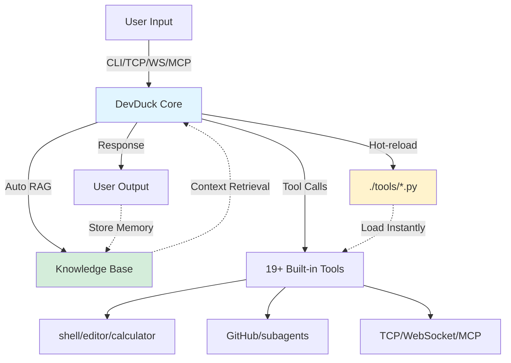

# 🦆 DevDuck

[](https://pypi.org/project/devduck/)
[](https://github.com/cagataycali/homebrew-devduck)

**Self-healing AI agent with hot-reload, RAG memory, and multi-protocol servers**

One Python file that adapts to your environment, fixes itself, and expands capabilities at runtime.

---

**Requirements:** Python ≥3.10, Ollama (or any Strands-supported provider)

```bash
# Quick install
pipx install "devduck[all]"

# Or instant run (no install)
uvx devduck "analyze this code"

# Or Homebrew
brew tap cagataycali/devduck && brew install devduck
```

---

## Quick Start

**CLI:**
```bash
devduck                      # Interactive + auto-start servers
devduck "calculate 15 * 7"   # One-shot query
```

**Python API:**
```python
from devduck import devduck

devduck("Create a Flask API for weather data")
```

**TCP client:**
```bash
nc localhost 9999
> help me debug this error
```

---

## Architecture



**Self-adapting loop:** User queries → RAG retrieval → Tool execution → Response → Memory storage → Hot-reload new capabilities → Repeat.

---

## Core Workflow

**3 steps: Install → Run → Extend**

### 1. Install & Start

```bash
pipx install "devduck[all]"
devduck
```

**Auto-starts:**
- 🔌 TCP server (port 9999)
- 🌊 WebSocket server (port 8080)
- 🔗 MCP server (port 8000)
- 📁 File watcher (hot-reload)

### 2. Use Built-in Tools

```python
from devduck import devduck

# Code editing
devduck("Create a FastAPI server in ./app.py")

# Shell commands
devduck("Install dependencies and run tests")

# GitHub integration
devduck("Create a gist with my training notes")

# Multi-agent workflows
devduck("Delegate data analysis to a subagent")
```

### 3. Extend with Hot-Reload

**Create custom tool:**
```python
# ./tools/weather.py
from strands import tool
import requests

@tool
def weather(city: str) -> str:
    """Get current weather for a city."""
    api_key = "your_key"
    url = f"https://api.openweathermap.org/data/2.5/weather?q={city}&appid={api_key}"
    data = requests.get(url).json()
    return f"{city}: {data['weather'][0]['description']}, {data['main']['temp']}°K"
```

**Save → Use instantly (no restart):**
```bash
🦆 weather(city="London")
# London: clear sky, 285.3°K
```

---

## Multi-Protocol Access

| Protocol | Endpoint | Usage |
|----------|----------|-------|
| **CLI** | Terminal | `devduck "query"` |
| **Python** | API | `from devduck import devduck` |
| **TCP** | `localhost:9999` | `nc localhost 9999` |
| **WebSocket** | `ws://localhost:8080` | Browser/Node.js clients |
| **MCP** | `http://localhost:8000/mcp` | Claude Desktop, other agents |
| **Web UI** | [cagataycali.github.io/devduck](http://cagataycali.github.io/devduck) | Browser interface |

**Custom ports:**
```bash
export DEVDUCK_TCP_PORT=9000
export DEVDUCK_WS_PORT=8001
export DEVDUCK_MCP_PORT=3000
devduck
```

---

## Built-in Tools

| Tool | Purpose |
|------|---------|
| **Development** |
| `shell` | Execute shell commands with PTY support |
| `editor` | Read/write/modify files with syntax highlighting |
| `python_repl` | Run Python code in isolated environment |
| `load_tool` | Load custom tools from `.py` files |
| `environment` | Manage environment variables |
| **GitHub & CI/CD** |
| `use_github` | GraphQL API operations (issues, PRs, repos) |
| `create_subagent` | Spawn GitHub Actions sub-agents |
| `gist` | Create/manage gists |
| `add_comment` | Comment on issues/PRs |
| `list_issues` / `list_pull_requests` | List repo items |
| **Network & Servers** |
| `tcp` | Start/manage TCP servers (streaming) |
| `websocket` | WebSocket server with concurrency |
| `mcp_server` | Expose as MCP server (HTTP/stdio) |
| `mcp_client` | Connect to external MCP servers |
| `http_request` | HTTP client with retry logic |
| **AI & Memory** |
| `use_agent` | Nested agent instances with different prompts |
| `install_tools` | Load tools from Python packages at runtime |
| `retrieve` | RAG retrieval from Bedrock Knowledge Base |
| `store_in_kb` | Store content in Knowledge Base |
| **Utilities** |
| `calculator` | SymPy-powered math (calculus, matrices, equations) |
| `image_reader` | Read images for vision models |
| `scraper` | BeautifulSoup4 HTML/XML parsing |
| `system_prompt` | View/modify agent system prompt |
| `view_logs` | Search/analyze devduck logs |

---

## RAG Memory

**Enable automatic context retrieval and storage:**

```bash
export STRANDS_KNOWLEDGE_BASE_ID="your-kb-id"
devduck
```

**How it works:**
1. **Before each query:** Retrieves relevant past conversations
2. **After each response:** Stores the interaction for future reference
3. **Zero manual calls:** Fully automatic

**Example:**
```python
# Session 1
devduck("I prefer FastAPI over Flask")
# Stored automatically

# Session 2 (days later)
devduck("Create a web API for me")
# Retrieves preference → uses FastAPI automatically
```

Works with AWS Bedrock Knowledge Bases.

---

## MCP Integration

**Claude Desktop config:**

```json
{
  "mcpServers": {
    "devduck": {
      "command": "uvx",
      "args": ["devduck", "--mcp"]
    }
  }
}
```

**Or connect as MCP client:**
```python
devduck("Connect to MCP server at http://localhost:9000/mcp")
```

---

## Multi-Model Support

**Switch providers via environment:**

```bash
# Bedrock (Claude Sonnet 4.5)
export MODEL_PROVIDER="bedrock"
export STRANDS_MODEL_ID="us.anthropic.claude-sonnet-4-5-20250929-v1:0"
export STRANDS_MAX_TOKENS="60000"
export STRANDS_ADDITIONAL_REQUEST_FIELDS='{"anthropic_beta": ["interleaved-thinking-2025-05-14", "context-1m-2025-08-07"], "thinking": {"type": "enabled", "budget_tokens": 2048}}'

# Anthropic API
export MODEL_PROVIDER="anthropic"
export STRANDS_MODEL_ID="claude-sonnet-4-20250514"

# Ollama (default - lightweight)
export MODEL_PROVIDER="ollama"
export OLLAMA_HOST="http://localhost:11434"

# GitHub Models
export MODEL_PROVIDER="github"
export STRANDS_MODEL_ID="openai/gpt-4o"
```

**Adaptive defaults:**
- macOS: `qwen3:1.7b` (lightweight)
- Linux: `qwen3:30b` (more power)
- Windows: `qwen3:8b` (balanced)

---

## Advanced Configuration

**Environment variables:**

| Variable | Default | Description |
|----------|---------|-------------|
| `MODEL_PROVIDER` | `ollama` | Model provider (bedrock, anthropic, ollama, github) |
| `STRANDS_MODEL_ID` | Auto | Specific model ID |
| `STRANDS_KNOWLEDGE_BASE_ID` | - | Enable auto-RAG |
| `DEVDUCK_TCP_PORT` | `9999` | TCP server port |
| `DEVDUCK_WS_PORT` | `8080` | WebSocket port |
| `DEVDUCK_MCP_PORT` | `8000` | MCP server port |
| `DEVDUCK_ENABLE_TCP` | `true` | Enable TCP server |
| `DEVDUCK_ENABLE_WS` | `true` | Enable WebSocket |
| `DEVDUCK_ENABLE_MCP` | `true` | Enable MCP server |
| `DEVDUCK_LOG_LINE_COUNT` | `50` | Log lines in system prompt context |
| `SYSTEM_PROMPT` | - | Custom system prompt override |

**Disable servers:**
```bash
export DEVDUCK_ENABLE_TCP=false
export DEVDUCK_ENABLE_WS=false
devduck  # Only MCP server
```

---

## Troubleshooting

**Ollama model not found:**
```bash
# DevDuck auto-pulls models, but if it fails:
ollama pull qwen3:1.7b
```

**Port already in use:**
```bash
# Change ports
export DEVDUCK_TCP_PORT=9000
export DEVDUCK_WS_PORT=8001
devduck
```

**Hot-reload not working:**
```bash
# Ensure tools directory exists
mkdir -p ./tools

# Check file watcher logs
devduck
🦆 view_logs(action="search", pattern="watcher")
```

**Memory/performance issues:**
```bash
# Use lighter model
export STRANDS_MODEL_ID="qwen3:0.5b"

# Reduce context
export DEVDUCK_LOG_LINE_COUNT=20
export DEVDUCK_LAST_MESSAGE_COUNT=50
```

**GitHub Actions timeout:**
```yaml
# Increase timeout in workflow
- uses: cagataycali/devduck@main
  with:
    task: "Complex task"
    timeout: "30m"  # Default is 10m
```

---

## GitHub Actions Integration

**Run DevDuck in CI/CD pipelines:**

```yaml
name: AI Code Assistant
on: 
  issues:
    types: [opened, edited]
  pull_request:
    types: [opened, edited, synchronize]

jobs:
  devduck:
    runs-on: ubuntu-latest
    permissions:
      contents: read
      issues: write
      pull-requests: write
    steps:
      - uses: cagataycali/devduck@main
        with:
          task: "Analyze and help with this issue or PR"
          provider: "github"
          model: "gpt-4o"
          tools: "shell,editor,use_github,calculator"
        env:
          GITHUB_TOKEN: ${{ secrets.GITHUB_TOKEN }}
```

**Sub-agent workflows:**
```python
devduck("Create a sub-agent to analyze test coverage")
```

---

## Resources

- **Strands SDK:** [github.com/strands-agents/sdk-python](https://github.com/strands-agents/sdk-python)
- **Documentation:** [strandsagents.com](https://strandsagents.com)
- **Web UI:** [cagataycali.github.io/devduck](http://cagataycali.github.io/devduck)
- **Homebrew:** [github.com/cagataycali/homebrew-devduck](https://github.com/cagataycali/homebrew-devduck)

---

## Citation

```bibtex
@software{devduck2025,
  author = {Cagatay Cali},
  title = {DevDuck: Self-Healing AI Agent with Hot-Reload and Multi-Protocol Servers},
  year = {2025},
  url = {https://github.com/cagataycali/devduck}
}
```

**Apache 2 License** | Built with [Strands Agents SDK](https://strandsagents.com)
