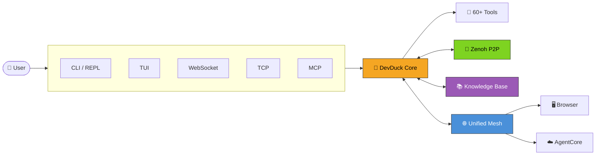
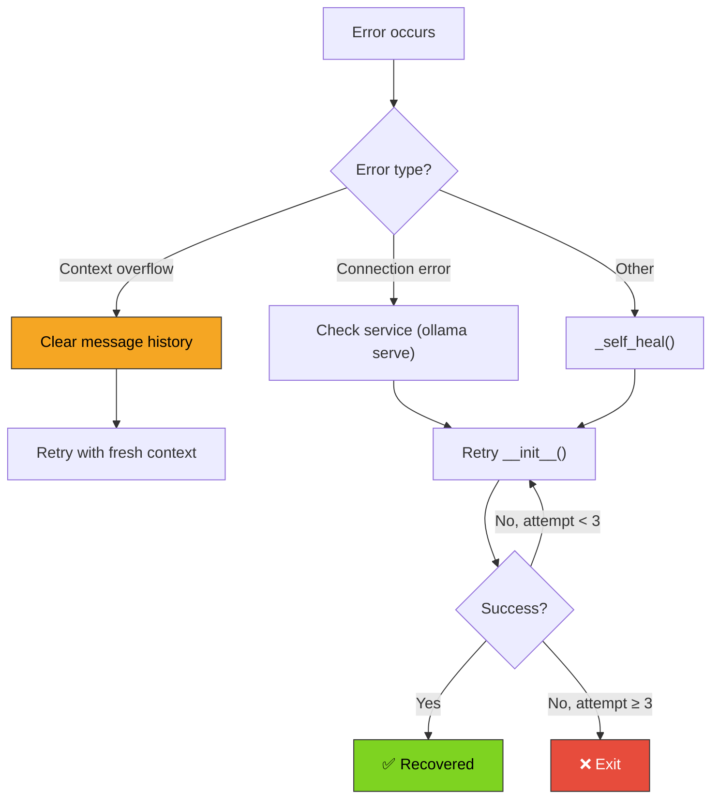
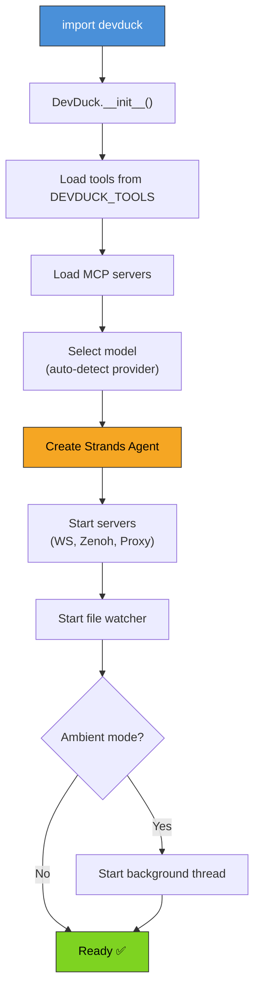
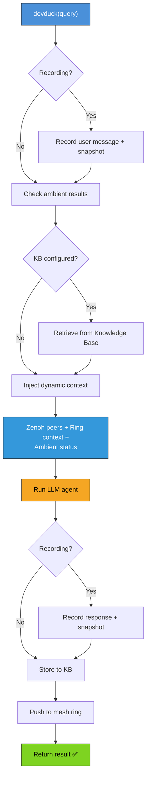
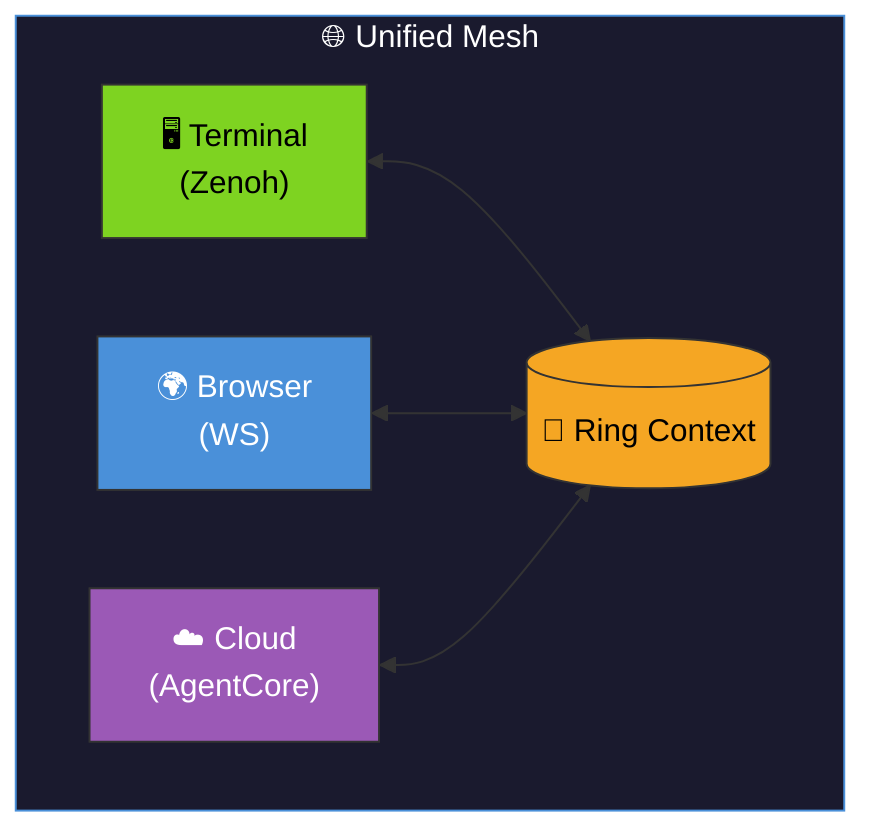

# Architecture

DevDuck is a single `DevDuck` class in `__init__.py` that auto-initializes on import.

---

## High-Level Architecture



**Ports:** 10000 (mesh relay) · 10001 (WebSocket) · 10002 (TCP) · 10003 (MCP) · multicast (Zenoh)

---

## File Structure

```
devduck/
├── __init__.py              # Core: DevDuck class, REPL, CLI, session recording, ambient mode
├── tui.py                   # Multi-conversation Textual TUI
├── landing.py               # Rich landing screen for REPL
├── callback_handler.py      # Streaming callback handler for CLI
├── asciinema_callback_handler.py  # .cast file recording
├── agentcore_handler.py     # HTTP handler for AgentCore deployment
├── tools/                   # 60+ built-in tools
│   ├── system_prompt.py     # Self-improvement via prompt management
│   ├── manage_tools.py      # Runtime tool add/remove/create/fetch
│   ├── manage_messages.py   # Conversation history management
│   ├── websocket.py         # WebSocket server
│   ├── zenoh_peer.py        # P2P auto-discovery networking (1602 lines)
│   ├── agentcore_proxy.py   # Unified mesh relay (1964 lines)
│   ├── unified_mesh.py      # Ring context shared memory (522 lines)
│   ├── mesh_registry.py     # File-based agent discovery (401 lines)
│   ├── tasks.py             # Background parallel agent tasks
│   ├── scheduler.py         # Cron and one-time job scheduling
│   ├── telegram.py          # Telegram bot integration
│   ├── slack.py             # Slack integration
│   ├── whatsapp.py          # WhatsApp via wacli
│   ├── speech_to_speech.py  # Real-time voice
│   ├── lsp.py               # Language Server Protocol
│   ├── use_mac.py           # Unified macOS control
│   ├── apple_vision.py      # On-device OCR, barcode, face detection
│   ├── apple_nlp.py         # On-device NLP
│   └── ...                  # 40+ more tools
└── tools/ (hot-reload)      # ./tools/*.py auto-loaded at runtime
```

---

## Core Design Patterns

### Self-Awareness

The system prompt includes the agent's **complete source code** via `get_own_source_code()`. This means the agent can inspect its own implementation to answer questions accurately — source code is truth, not conversation memory.

### Self-Healing



### Hot-Reload

A background `_file_watcher_thread` monitors `__init__.py` for changes. On detection, `os.execv()` restarts the process. If the agent is executing, reload is deferred until completion (`_reload_pending`).

### Dynamic Tool Loading

Tools are configured via `DEVDUCK_TOOLS` env var. Additional tools can be loaded at runtime via `manage_tools()` or by dropping `.py` files in `./tools/`.

---

## Initialization Flow



---

## Query Flow



---

## Mesh Architecture

See [Unified Mesh](guide/mesh.md) for the full deep dive. Summary:



Four components: **Registry** (file-based peer discovery) → **Ring Context** (shared activity buffer) → **Relay** (WebSocket bridge on :10000) → **Zenoh** (P2P terminal-to-terminal).

---

## Module Callable Pattern

The module itself is callable — no need to access the `devduck` instance:

```python
import devduck
devduck("query")  # Works because of CallableModule metaclass
```

This is achieved by replacing `sys.modules[__name__].__class__` with a custom `CallableModule` that defines `__call__`.

---

## State Management

| Data | Location | Persistence |
|------|----------|-------------|
| Conversation history | `agent.messages` | In-memory (cleared on restart) |
| Shell history | `~/.devduck_history` | Persistent |
| Logs | `/tmp/devduck/logs/devduck.log` | Rotating (10MB × 3) |
| Session recordings | `/tmp/devduck/recordings/` | Persistent ZIP files |
| Mesh registry | `/tmp/devduck/mesh_registry.json` | File-based with TTL |
| Ring context | In-memory (`unified_mesh.py`) | Volatile (100 entries) |
| Scheduler jobs | Disk-persisted | Persistent |
| SQLite memory | Default path | Persistent |
| Knowledge Base | AWS Bedrock | Cloud-persistent |

---

## Framework

Built on [Strands Agents SDK](https://strandsagents.com) — a model-agnostic agent framework with tool use, streaming, and multi-provider support.
