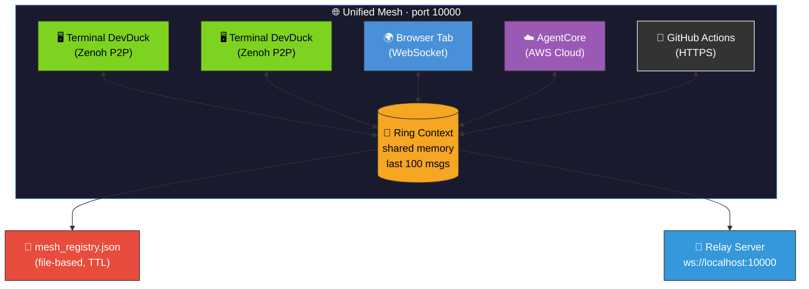
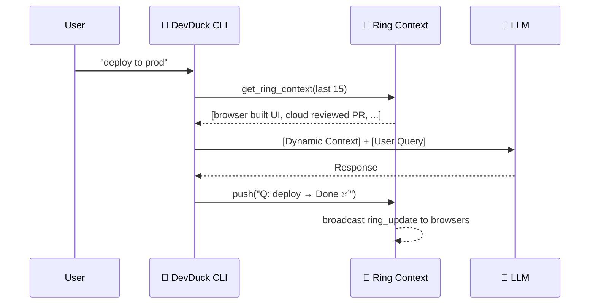

# Unified Mesh

DevDuck's shared nervous system. Every agent — terminal, browser, or cloud — sees what others are doing via a **ring context**.

---

## Architecture



---

## Four Peer Types

| Peer Type | Discovery | Transport | Example |
|-----------|-----------|-----------|---------|
| **Zenoh** | Multicast scouting (224.0.0.224:7446) | P2P UDP/TCP | Two terminal DevDucks auto-find each other |
| **Browser** | WebSocket connect to :10000 | WS | Custom web UI registers as peer |
| **AgentCore** | AWS API (`ListAgentRuntimes`) | HTTPS | Cloud-deployed agents via `devduck deploy` |
| **GitHub** | GitHub Actions API | HTTPS | Workflow-based agents from configured repos |

---

## Components

### 1. Registry (`mesh_registry.py`)

File-based agent registry with TTL. Any process can read/write. All peer types register here.

```python
# Internally writes to /tmp/devduck/mesh_registry.json
{
  "80a99724-abc123": {
    "type": "zenoh",
    "last_seen": 1774549619.85,
    "metadata": {
      "hostname": "macbook",
      "model": "BedrockModel",
      "tool_count": 36,
      "platform": "Darwin arm64"
    }
  }
}
```

Stale peers are automatically pruned based on TTL.

### 2. Ring Context (`unified_mesh.py`)

In-memory circular buffer (last 100 entries). Every agent interaction is pushed here. The CLI DevDuck injects ring context into every query.

```python
# What gets injected into your prompt automatically:
[14:20:59] local:devduck-tui → Q: deploy API → Done ✅
[14:21:05] browser:react-app → Built component library
[14:21:10] agentcore:reviewer → PR #42 approved
```

This means your terminal DevDuck **always knows** what browser and cloud agents just did.

### 3. Relay (`agentcore_proxy.py`)

WebSocket server on port 10000 that bridges everything:

- Browser connects → gets real-time `ring_update` events
- Browser sends `invoke` → routes to Zenoh peer or AgentCore agent
- CLI writes to ring → browser gets notified instantly
- Handles peer discovery, invocation, broadcasting, ring sync

### 4. Zenoh (`zenoh_peer.py`)

P2P layer for terminal-to-terminal communication. Heartbeats every 5s, auto-prune stale peers, remote command execution.

See [Zenoh P2P guide](zenoh.md) for details.

---

## Ring Context Injection

Every time you send a query to DevDuck, the mesh ring is automatically injected as context:



No explicit sync — it just happens on every query.

---

## WebSocket Protocol

Connect to `ws://localhost:10000` for mesh access:

```json
// List all peers across all layers
{"type": "list_peers"}

// Invoke any peer (Zenoh or AgentCore)
{"type": "invoke", "peer_id": "hostname-abc123", "prompt": "run tests"}

// Broadcast to all Zenoh peers
{"type": "broadcast", "message": "git pull"}

// Get recent ring activity
{"type": "get_ring", "max_entries": 20}

// Push your own entry to the ring
{"type": "add_ring", "agent_id": "my-bot", "text": "task complete"}

// Register as a browser peer in the mesh
{"type": "register_browser_peer", "name": "my-ui", "model": "gpt-4o"}
```

### Response Events

```json
// Peer list
{"type": "peers_list", "peers": [...], "total": 5}

// Ring update (real-time push)
{"type": "ring_update", "entry": {"agent_id": "...", "text": "..."}}

// Streaming invoke response
{"type": "invoke_chunk", "peer_id": "...", "data": "..."}
{"type": "invoke_complete", "peer_id": "..."}
```

---

## Browser Integration

Any web page can join the mesh:

```javascript
const ws = new WebSocket('ws://localhost:10000');

// Register as a peer
ws.onopen = () => {
  ws.send(JSON.stringify({
    type: 'register_browser_peer',
    name: 'my-dashboard',
    model: 'browser-agent'
  }));
};

// Listen for ring updates
ws.onmessage = (event) => {
  const msg = JSON.parse(event.data);
  if (msg.type === 'ring_update') {
    console.log(`${msg.entry.agent_id}: ${msg.entry.text}`);
  }
};

// Invoke a terminal DevDuck
ws.send(JSON.stringify({
  type: 'invoke',
  peer_id: 'hostname-abc123',
  prompt: 'what files changed today?'
}));
```

---

## Configuration

```bash
export DEVDUCK_ENABLE_AGENTCORE_PROXY=true   # Enable mesh relay (default: true)
export DEVDUCK_AGENTCORE_PROXY_PORT=10000    # Relay port (default: 10000)
export DEVDUCK_ENABLE_ZENOH=true             # Enable P2P (default: true)
```

---

## Use Cases

| Scenario | How |
|----------|-----|
| **Multi-terminal awareness** | Open 2 terminals with `devduck` — they auto-discover via Zenoh |
| **Browser + CLI collaboration** | Browser UI registers as peer, sees CLI activity in real-time |
| **Cloud agent orchestration** | `devduck deploy` agents appear in mesh, invocable from CLI or browser |
| **Team coordination** | Connect Zenoh across networks: `ZENOH_CONNECT=tcp/coworker:7447` |
| **CI/CD integration** | GitHub Actions agents push status to ring, CLI sees it immediately |
