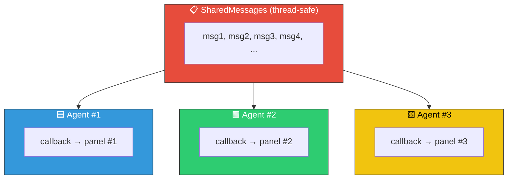
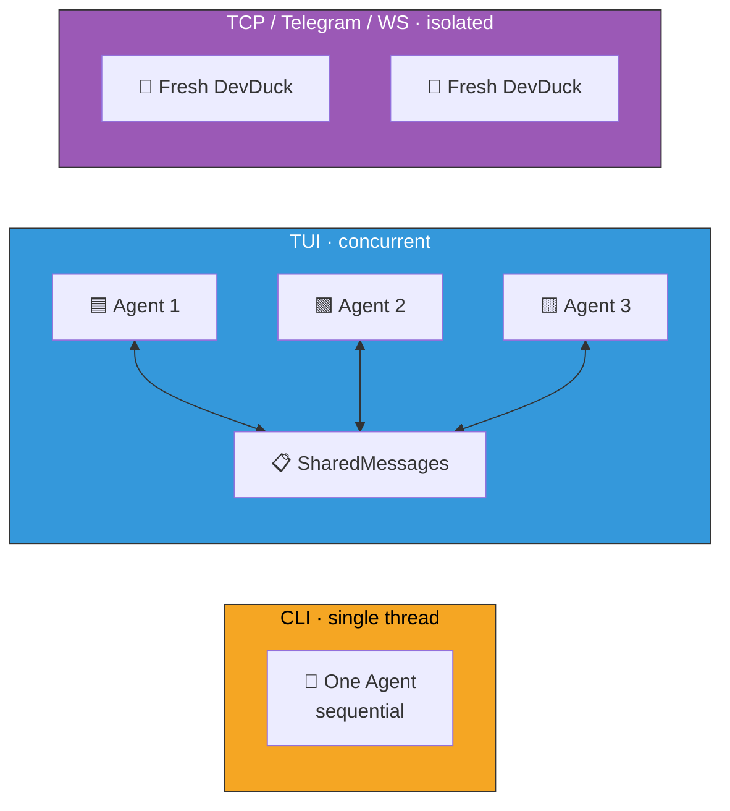

# TUI Mode

Multi-conversation terminal UI with concurrent panels, streaming markdown, and shared awareness.

---

## Launch

```bash
devduck --tui
```

!!! note "Requires `textual`"
    ```bash
    pip install textual
    ```

---

## Concurrency Model



Each conversation creates a **fresh Agent** instance, but all agents point their `.messages` at a single `SharedMessages` instance — a thread-safe list subclass that serializes all reads and writes via a lock.

### What this gives you

- **True concurrency** — separate Agent instances with separate callback handlers, no conflicts
- **Real-time shared awareness** — when Agent #1 appends a message, Agent #2 sees it immediately
- **Correct ordering** — the lock ensures messages are appended in order
- **Isolated rendering** — each agent's callback routes streaming output to its own color-coded panel

### Message cap

Shared history is capped at 100 messages (configurable via `DEVDUCK_TUI_MAX_SHARED_MESSAGES`) and auto-clears on context window overflow.

---

## Features

| Feature | Description |
|---------|-------------|
| **Multiple conversations** | Run several conversations concurrently in separate panels |
| **Streaming markdown** | Rich formatted output as the agent responds |
| **Interleaved execution** | Conversations run in parallel, not blocking each other |
| **Full tool access** | Each conversation has the complete tool set |
| **Shared context** | All conversations share awareness via `SharedMessages` |
| **Mesh integration** | Each TUI conversation pushes to the unified ring context |

---

## Comparison Across Interfaces



| Interface | Agent per request | Shared messages | Use case |
|-----------|:-:|:-:|---|
| **CLI** | No (reuse one) | N/A (single-threaded) | Sequential interactive REPL |
| **TUI** | Yes (fresh Agent) | Yes (`SharedMessages`) | Concurrent conversations with shared context |
| **TCP** | Yes (fresh DevDuck) | No (fully isolated) | External network clients |
| **Telegram** | Yes (fresh DevDuck) | No (fully isolated) | Chat bot, each user isolated |
| **WebSocket** | Yes (fresh DevDuck) | No (fully isolated) | Browser clients |

---

## Configuration

| Variable | Default | Description |
|----------|---------|-------------|
| `DEVDUCK_TUI_MAX_SHARED_MESSAGES` | `100` | Max shared message history |
